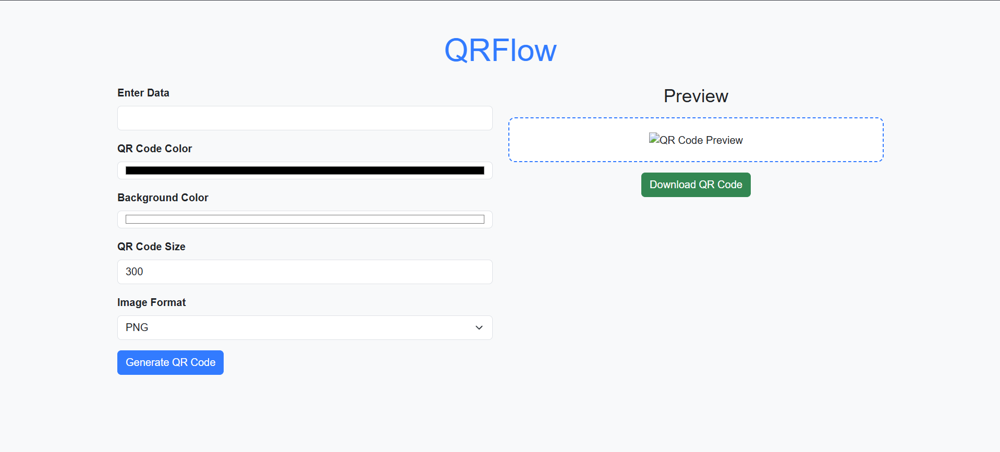
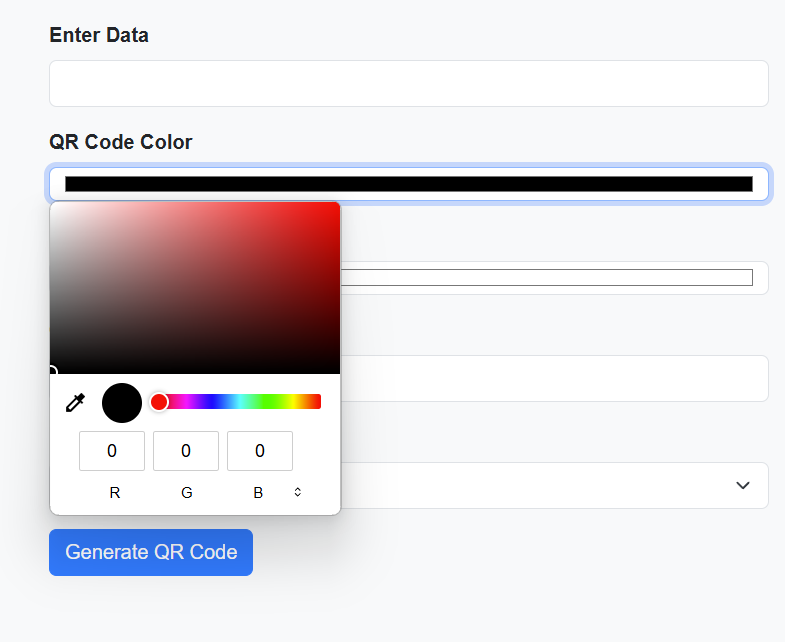
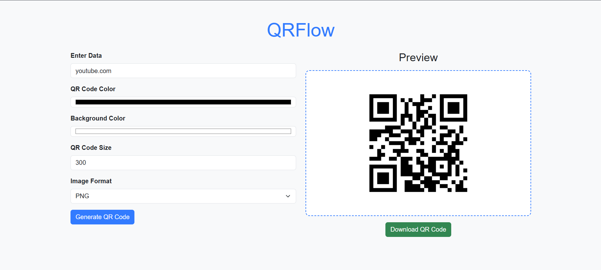

# **QRFlow - Ultimate QR Code Generator 🚀**

  
**QRFlow** is a powerful, customizable, and user-friendly QR Code generator built with Python and Flask. Whether you're a developer, marketer, or just someone who loves cool tech, QRFlow has got you covered!

---

## **Features ✨**

- **🎨 Fully Customizable**: Change QR Code colors, add gradients, and tweak sizes.
- **🚀 Lightning Fast**: Generate QR Codes in real-time with a sleek interface.
- **💡 Smart Options**: Add gradients, choose colors, and customize the output format.
- **📥 Instant Download**: Get your QR Code in PNG, JPEG, or SVG format with a single click.
- **📊 Logging**: Detailed logs for every QR Code generated.
- **💻 Open Source**: Built with ❤️ using Python and Flask. Contribute and make it even better!

---

## **Screenshots 📸**

### **Home Page**


### **Customization Options**


### **Generated QR Code**


---

## **Installation 🛠️**

### **Prerequisites**
- Python 3.8 or higher
- pip (Python package manager)

### **Steps**
1. Clone the repository:
   ```bash
   git clone https://github.com/Mehregan6/QRFlow.git
   cd QRFlow  
   pip install -r requirements.txt
   python app.py
Open your browser and go to http://127.0.0.1:5000.

---

## **Usage 🖥️**
Enter Data: Type the data you want to encode in the QR Code (e.g., a URL, text, or contact info).

**Customize:**

**Color: Choose the QR Code color.**

**Background Color: Choose the background color.**

**Size: Set the size of the QR Code (100–1000 pixels).**

**Format: Choose the output format (PNG, JPEG, or SVG).**

**Generate: Click the "Generate QR Code" button.**

**Download: Click the "Download" button to save your QR Code.**

---

## **Logging 📝**
QRFlow automatically logs every QR Code generation. You can find the logs in the log.log file in the project directory. Each log entry includes:

Timestamp

Data encoded in the QR Code

Color and background color

Size and format

Example log entry:
   ```bash
   2023-10-01 12:34:56 - QR Code generated with data: https://example.com, Color: #000000, Background: #FFFFFF, Size: 300, Format: png
   ```
## **Star the Repo ⭐**

If you find QRFlow useful, please give it a star on GitHub! Your support means a lot to us.

[](https://github.com/Mehregan6/QRFlow/stargazers)

## **Contact Me 📞**

If you have any questions, suggestions, or business inquiries, feel free to reach out to me on Telegram. I'm always happy to connect!

[](https://t.me/dev_Mehregan)

**Click the button above to message me on Telegram!**
